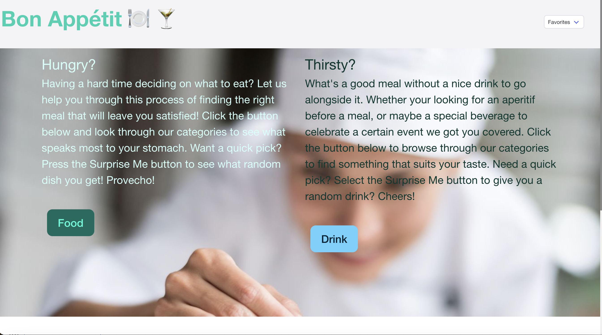

# Bon Appétit Food and Cocktail Recipe Search Application

## Description
This application is a food and cocktail search engine where the user can browse through various categories to find a meal or drink that might interest them.  It can be challenging making a decision on what to eat, so we give the user the opportunity to explore different options and narrow down those choices.  In order to build this application our team incorporated two API’s ,TheMealDB and TheCocktailDB, to fetch the information about food and drinks recipes that will be displayed on the page. Using jQuery we targeted the buttons that will be used to search recipes, add items to the favorites section, and dynamically create elements to be displayed to the user.  Once the search buttons is clicked a modal, created using jQuery user interface, pops up to give the user categories for food and beverage to select.  This purpose of this project was to learn how to collaborate and collectively create a functioning program.  We used pair programming many times during the development process.   As a group we had many challenges combining our code and working through all the conflicts.  At most times it was difficult trying to stay on the same page because of our different approaches to coding.  However, through constant communication and support among our group members we were able to produce a product that we are very proud of.

## Collaborators
Ezekiel Campos
* [GitHub](https://github.com/EzekielCampos)

Ifeyinwa Ekezie
* [GitHub](https://github.com/Ifylee)

Yabsera Elias
* [GitHub](https://github.com/yabseraelias)

Wolfgang Leithold
* [GitHub](https://github.com/wolfleithold)

## Usage
This program allows a user to browse through a selection of food and cocktail recipes.  When a user finds a category that they might be interested in, a variety of options are displayed at the bottom of the page.  If there a certain dish or cocktail that a user would like to save, there is an option to add the name of the dish to favorites which will displayed in the header.  Having a hard time making a decision?  No worries there's an option to randomly select a meal or drink for the user if they do not want to browse through our options

### Link
https://ezekielcampos.github.io/bon-appetit-food-cocktail-recipe-search-application/

### Screenshot
